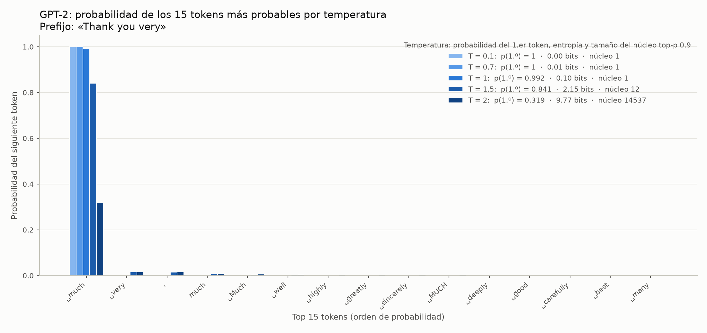
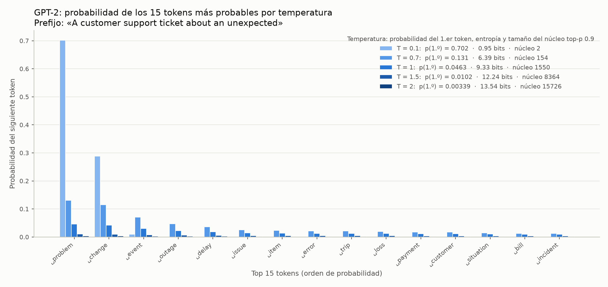
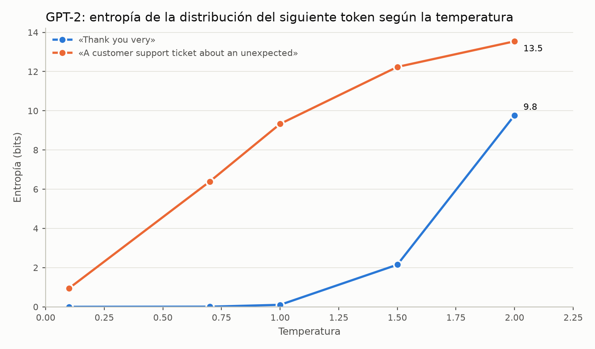
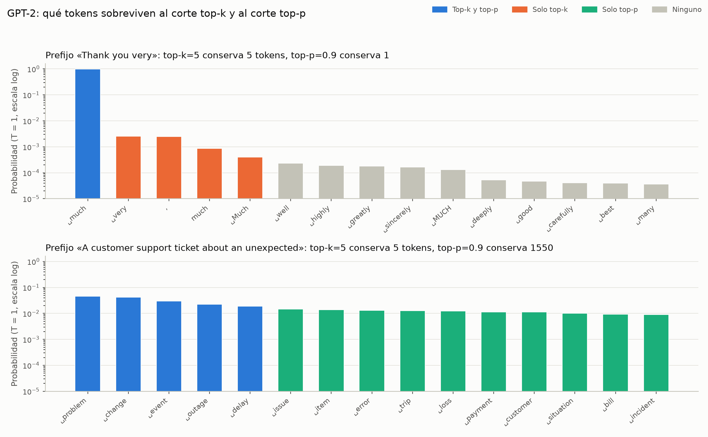
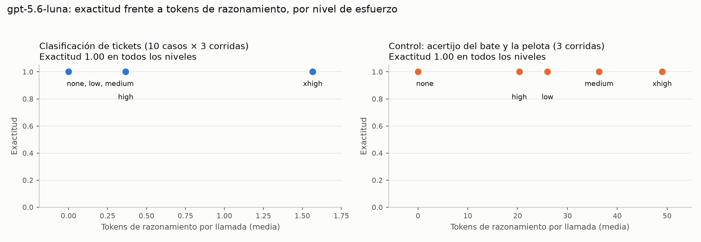
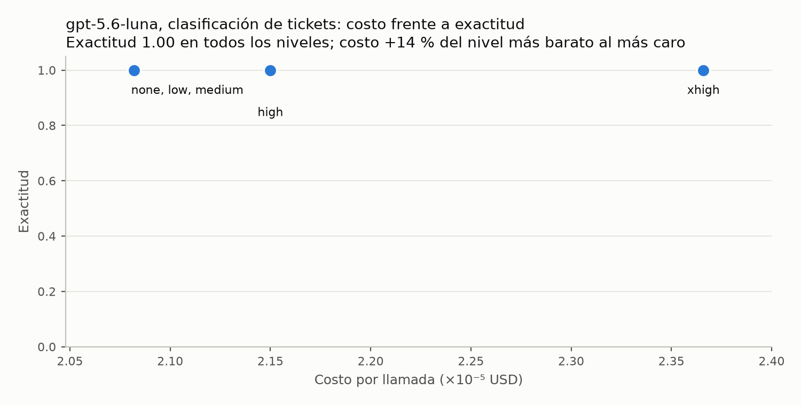

<!--
BORRADOR generado con scripts/build_report.py (los números salen de outputs/, no se escriben a mano).
Antes de entregar: editar el texto a la voz propia, completar el nombre y declarar la asistencia de IA
en el código, los casos y este borrador si la política del curso lo pide.
-->

# Taller 01 — Foundation Models

**Estudiante:** [Paolo Arrata]  
**Curso:** Inteligencia Artificial Generativa, USFQ  
**Fecha de las corridas:** 2026-09-19

## 1. Introducción

Se estudió cómo cambia el comportamiento de un modelo de lenguaje cuando se mueve, de a una, cada palanca de inferencia: el muestreo (temperature, top-p, top-k), el contenido del prompt, la forma de la salida, el costo y el esfuerzo de razonamiento. Todo se hizo sobre un único problema, con un único verificador y una única función de inferencia. En total se registraron **1 519 llamadas** a modelos, con **15 errores**, y el gasto en APIs fue de **$0.052**.

El resultado que más pesa es una ausencia. En este problema casi ninguna palanca movió la exactitud, porque los modelos ya acertaban todo; lo que sí se movió fue el costo. Además, varias cosas que el enunciado da por supuestas se cayeron al medirlas: un prefijo «seguro» que en GPT-2 no lo era, un nivel de esfuerzo de razonamiento que la API rechaza, y tres parámetros de muestreo que un modelo no acepta. Esas correcciones se cuentan en cada parte, y las limitaciones de todo esto se reúnen en las conclusiones.

## 2. Problema elegido

Dado un ticket de soporte, clasificarlo en exactamente una categoría: `billing`, `technical` o `account`. La salida esperada es un objeto JSON, `{"category": "billing"}`. Se eligió este problema porque la respuesta se puede verificar sin juicio humano ni un segundo modelo: se parsea el JSON y se compara la categoría con la esperada. Eso permite medir exactitud de forma determinista, repetir el mismo caso decenas de veces y comparar variantes de prompt sin que la evaluación cambie con ellas.

## 3. Dataset

Hay tres conjuntos, todos en `data/`:

- **10 casos oficiales** (`cases.json`): 4 de `billing`, 3 de `technical` y 3 de `account`. Se fijaron antes de cualquier barrido y no cambian entre modelos, temperaturas ni variantes de prompt.
- **5 casos de debug** (`cases.json`, campo `split`): solo para pruebas internas; ningún resultado del informe los usa.
- **3 casos contaminados** (`contaminated_cases.json`): uno por tipo de trampa, para la Parte 4.b.

Hay que decir de dónde salen: **todos los tickets son sintéticos**, redactados para este taller. No vienen de un sistema de soporte real, así que la exactitud que se reporta es sobre tickets fáciles y limpios, y no dice nada sobre tickets reales, que son más ruidosos y ambiguos. Cada ticket tiene una categoría correcta inequívoca y ninguno se reutiliza como ejemplo en el prompt few-shot (hay una prueba automática que lo comprueba).

## 4. Metodología

**Un solo camino.** Cada llamada pasa por `run_case`: se construye el prompt, se llama al modelo, se verifica la respuesta con `verify_prediction`, se calcula el costo y se agrega una línea a `results.jsonl`. Ese archivo es la fuente de verdad y nunca se sobrescribe; las tablas y gráficas de este informe se generan a partir de él (y este texto, con `scripts/build_report.py`, para no copiar números a mano). Si una llamada falla, queda registrada como error con el mensaje literal y el código HTTP.

**Verificador.** Distingue tres fallos: salida que no es JSON, JSON con una categoría fuera del enum, y categoría válida pero incorrecta. Se mide entonces `parse_rate` (JSON parseable), formato válido (categoría dentro del enum) y exactitud, y las tres cosas pueden diferir.

**Definiciones.** La exactitud de una celda es aciertos entre todas sus llamadas (un error de API cuenta como fallo). La estabilidad de un caso es la parte de sus corridas que coincide con la respuesta más frecuente; la de la celda es el promedio de los casos. Una salida inválida se cuenta como una sola respuesta.

**Modelos y precios.** Los precios de los modelos de pago llevan fecha de verificación; el costo se calcula con los tokens que reporta el proveedor (los de razonamiento se cobran como salida).

| Clave | Proveedor | Modelo | USD/1M entrada | USD/1M salida | Precio verificado |
|---|---|---|---|---|---|
| propietario_grande | openai | gpt-5.5 | 5 | 30 | 2026-09-19 |
| propietario_economico | openai | gpt-4o-mini | 0.15 | 0.6 | 2026-08-26 |
| open_weight_pequeno | ollama | qwen3:1.7b | 0 | 0 | n/a (local, sin precio por token) |
| openai_razonamiento | openai | gpt-5.6-luna | 0.2 | 1.2 | 2026-09-18 |

Hay tres desviaciones que conviene declarar. Primero, la tabla del curso asigna `claude-opus-4-8` a `propietario_grande`, pero no había clave de Anthropic, y se usó `gpt-5.5` de OpenAI; su precio salió de la página de precios de OpenAI el 2026-09-19 y **no** de la tabla del curso, así que hay que contrastarlo. Segundo, el costo 0 de `qwen3:1.7b` es la ausencia de precio por token de un modelo local y no cuenta el hardware; se corrió con Ollama y con el razonamiento apagado (`think: false`) para compararlo como un modelo instruct normal. Tercero, `top_k` no se envía por la API de OpenAI de forma nativa: se manda en el cuerpo de la petición para que sea la API quien lo acepte o rechace, y no un error del cliente.

**Reproducibilidad.** Semilla 42 donde el backend lo permite. Las APIs no garantizan salidas idénticas ni con temperature 0, y no se afirma lo contrario. Los barridos caros son reanudables: una llamada ya registrada como correcta se omite.

## 5. Parte 0 — GPT-2 base

**Se elige el prefijo por medición, no por suposición.** El plan sugiere `The capital of France is` como frase de alta confianza. En GPT-2 no lo es: a T=1 su token más probable es `the` con probabilidad **0.085** y la entropía es de **8.65 bits**, casi la de un prefijo incierto (9.33 bits). Por eso se midió la entropía a T=1 de 7 frases candidatas y se eligió la de menor entropía, `Thank you very` (0.10 bits; `much` con 0.992). Para el prefijo incierto se usó una frase del dominio, `A customer support ticket about an unexpected`.

| Prefijo | Entropía a T=1 (bits) | Token más probable | p | Elegido como |
|---|---|---|---|---|
| The capital of France is | 8.65 | ' the' | 0.085 |  |
| The quick brown fox jumps over the lazy | 9.29 | ',' | 0.056 |  |
| Once upon a | 8.51 | ' time' | 0.177 |  |
| Thank you very | 0.10 | ' much' | 0.992 | alta confianza |
| The United States of | 0.53 | ' America' | 0.966 |  |
| Happy birthday to | 7.71 | ' you' | 0.187 |  |
| 1, 2, 3, 4, 5, 6, | 0.60 | ' 7' | 0.951 |  |
| A customer support ticket about an unexpected | 9.33 | ' problem' | 0.046 | baja confianza |

**0.a — temperatura.** La entropía y el tamaño del núcleo top-p 0.9 crecen con la temperatura en los dos prefijos (Figuras 1 a 3).

| Prefijo | T | Entropía (bits) | Núcleo top-p 0.9 |
|---|---|---|---|
| Thank you very | 0.1 | 0.00 | 1 |
| Thank you very | 0.7 | 0.01 | 1 |
| Thank you very | 1.0 | 0.10 | 1 |
| Thank you very | 1.5 | 2.15 | 12 |
| Thank you very | 2.0 | 9.77 | 14537 |
| A customer support ticket about an unexpected | 0.1 | 0.95 | 2 |
| A customer support ticket about an unexpected | 0.7 | 6.39 | 154 |
| A customer support ticket about an unexpected | 1.0 | 9.33 | 1550 |
| A customer support ticket about an unexpected | 1.5 | 12.24 | 8364 |
| A customer support ticket about an unexpected | 2.0 | 13.54 | 15726 |

El prefijo seguro se comporta casi como una decisión determinista hasta T=1 y solo se abre a partir de T=1.5; el incierto ya es amplio desde T=0.7. A T=2 ambos se acercan al máximo posible (el vocabulario tiene 50 257 tokens, unos 15.6 bits).



*Figura 1. Probabilidad de los 15 tokens más probables para el prefijo «Thank you very», una barra por temperatura. La leyenda da la probabilidad del primer token, la entropía y el tamaño del núcleo top-p 0.9.*



*Figura 2. Lo mismo para el prefijo del dominio, «A customer support ticket about an unexpected».*



*Figura 3. Entropía de la distribución del siguiente token según la temperatura, para los dos prefijos.*

**0.b — las tres palancas** (prefijo `A customer support ticket about an unexpected`, 40 tokens nuevos):

1. Con `do_sample=False` y temperature 0.2 o 1.5, la salida es **idéntica** entre las dos y respecto de greedy: la temperatura se ignora. La librería lo avisa: «The following generation flags are not valid and may be ignored: ['temperature']. Set `TRANSFORMERS_VERBOSITY=info` for more details.».
2. Con `top_k=1` y muestreo activado, cinco corridas con semillas 42–46 dan salidas **idénticas entre sí** y **iguales a greedy**.
3. Con top-k=5 y top-p=0.9 sobre la misma distribución (T=1) sobreviven conjuntos distintos, y en sentido contrario según la confianza del modelo: en el prefijo seguro top-k conserva **5** tokens y top-p **1**; en el incierto, top-k conserva **5** y top-p **1550**. Top-k corta por cantidad fija; top-p se adapta a cuánta masa hay concentrada (Figura 4, en escala logarítmica porque con un token dominante el resto sería invisible).
4. Con greedy a 100 tokens la generación entra en un bucle: la frase «The customer support ticket about an unexpected problem» aparece **9 veces**. La salida cruda, sin editar, está en `outputs/raw/part0b.json`.



*Figura 4. Qué tokens conservan el corte top-k=5 y el corte top-p=0.9 sobre la misma distribución (T=1), en un prefijo seguro (arriba) y en uno incierto (abajo). Escala logarítmica en el eje vertical.*

Las definiciones de top-k y top-p que se usaron para contar los conjuntos se comprobaron contra los `TopKLogitsWarper` y `TopPLogitsWarper` de `transformers`, que son los que aplica `generate()`.

**0.c — límite del modelo base.** Con el mismo prompt de clasificación de la Parte 1, GPT-2 base obtuvo **0 de 10** respuestas parseables y 0 correctas. No sigue la instrucción: en 4 de los 10 casos repite el ticket tal cual y en el resto divaga. Dos ejemplos crudos: para el caso 1 escribió «I was charged twice for the same subscription. I was charged twice for the same subscription. I was charged twice for the same subscription. I was charged twice for the s…»; para el caso 9, «If you want to delete the data, you can use the following command: $ curl -X POST -d '{"category": "my-category"}' -H 'Content-Type: application/json' -d '{"category": "m…», un comando que copia el formato `{"category": ...}` del prompt con un valor sin sentido.

## 6. Parte 1 — comparación de modelos

**Los tres modelos acertaron los 10 casos** con JSON válido, así que este problema no los separa por exactitud. Lo que sí los separa es el costo y la latencia.

| Modelo | Exactitud | Latencia media (s) | Latencia p50 (s) | Tokens entrada | Tokens salida | Costo total | Parse rate |
|---|---|---|---|---|---|---|---|
| gpt-5.5 | 1.00 | 0.97 | 0.94 | 56.1 | 23.1 | $0.00973 | 1.00 |
| gpt-4o-mini | 1.00 | 0.70 | 0.70 | 57.1 | 6.0 | $0.00012 | 1.00 |
| qwen3:1.7b | 1.00 | 0.15 | 0.13 | 66.3 | 7.0 | $0.00000 | 1.00 |

`gpt-5.5` cuesta unas **80 veces** más que `gpt-4o-mini` para el mismo resultado. Parte de esa diferencia es el precio por token y parte es que es un modelo de razonamiento: sus 23.1 tokens de salida por llamada incluyen tokens de razonamiento que se cobran como salida. La latencia media de `qwen3:1.7b` (0.15 s) no incluye red, así que no es comparable con la de los modelos de pago (0.70 s y 0.97 s); la primera llamada del modelo local tardó 3.55 s por cargar el modelo en memoria, pero esa fila no entra en la tabla porque se usa la última fila por caso. Las notas cualitativas por modelo están en `report/part1_notes.json`.

Con exactitud igual y 10 casos fáciles no se puede decir cuál modelo es «mejor»; solo que en esta tarea el más caro no aportó nada medible.

## 7. Parte 2.a — matriz de exposición de parámetros

Para cada modelo y parámetro se probó un valor bajo y uno alto, con 5 corridas cada uno y un prompt abierto donde el muestreo sí cambia la salida. Un HTTP 200 no basta para decir que un parámetro actúa; el criterio fue que hubiera más salidas distintas con el valor alto que con el bajo. Si la API respondía 400 o 422 se registraba el rechazo con su mensaje literal.

| Modelo | Parámetro | Declarado | Observado | HTTP | Salidas distintas (bajo / alto) | Verificado |
|---|---|---|---|---|---|---|
| propietario_grande | temperature | no documentado | rechazado | 400 | 0 / 0 | 2026-09-19 |
| propietario_grande | top_p | no documentado | rechazado | 400 | 0 / 5 | 2026-09-19 |
| propietario_grande | top_k | no | rechazado | 400 | 0 / 0 | 2026-09-19 |
| propietario_economico | temperature | sí | acepta y actúa | 200 | 1 / 5 | 2026-09-19 |
| propietario_economico | top_p | sí | acepta y actúa | 200 | 1 / 5 | 2026-09-19 |
| propietario_economico | top_k | no | rechazado | 400 | 0 / 0 | 2026-09-19 |
| open_weight_pequeno | temperature | sí | acepta y actúa | 200 | 1 / 5 | 2026-09-19 |
| open_weight_pequeno | top_p | sí | acepta y actúa | 200 | 1 / 4 | 2026-09-19 |
| open_weight_pequeno | top_k | sí | acepta y actúa | 200 | 1 / 3 | 2026-09-19 |

De las 9 celdas, **5 aceptan y actúan** y **4 se rechazan**. `gpt-4o-mini` y `qwen3:1.7b` aceptan y actúan en lo que soportan; `top_k` lo rechazan las dos APIs de OpenAI, tal como se declaraba. La sorpresa es `gpt-5.5`, que rechaza los tres parámetros: solo admite los valores por defecto, y por eso su celda de `top_p` dice 0 / 5 (el valor bajo se rechazó y el alto, 1.0, que es el por defecto, se aceptó). En la columna «Declarado» de `gpt-5.5` figura «no documentado» porque su página de modelo no dice nada sobre estos parámetros. Los mensajes literales:

- `propietario_grande`, `temperature` (HTTP 400): «Unsupported value: 'temperature' does not support 0.0 with this model. Only the default (1) value is supported.»
- `propietario_grande`, `top_p` (HTTP 400): «Unsupported parameter: 'top_p' is not supported with this model.»
- `propietario_grande`, `top_k` (HTTP 400): «Unknown parameter: 'top_k'. Did you mean 'top_p'?»
- `propietario_economico`, `top_k` (HTTP 400): «Unrecognized request argument supplied: top_k»

Hay un límite que conviene tener presente: el criterio descansa en cinco corridas por ajuste, así que es evidencia y no una prueba. Los valores «declarados» de los otros dos modelos salen del plan y de la documentación conocida de cada API, y no se verificaron contra la tabla del curso.

## 8. Parte 2.b — barrido de decoding

Se barrieron 15 celdas de temperature × top-p sobre `gpt-4o-mini` (10 casos × 5 corridas, 750 llamadas) y, aparte, top-k sobre `qwen3:1.7b` (200 llamadas), porque la API de OpenAI rechaza `top_k`. Cada celda de la tabla muestra exactitud / estabilidad.

| Temperatura \ top-p | 0.5 | 0.9 | 1.0 |
|---|---|---|---|
| 0.0 | 1.00 / 1.00 | 1.00 / 1.00 | 1.00 / 1.00 |
| 0.3 | 1.00 / 1.00 | 1.00 / 1.00 | 1.00 / 1.00 |
| 0.7 | 1.00 / 1.00 | 1.00 / 1.00 | 1.00 / 1.00 |
| 1.0 | 1.00 / 1.00 | 1.00 / 1.00 | 1.00 / 1.00 |
| 1.5 | 1.00 / 1.00 | 1.00 / 1.00 | 1.00 / 1.00 |

**En las 15 celdas la exactitud mínima fue 1.00 y la estabilidad mínima 1.00**, con 0 errores. La única diferencia visible fue una salida con JSON compacto en la celda de temperatura 1.5 y top-p 1.0 (5.98 tokens de salida en media), con la misma categoría. Para top-k:

| top-k | Temperatura | Llamadas | Exactitud | Estabilidad | Coincide con greedy |
|---|---|---|---|---|---|
| — (greedy) | 0.0 | 50 | 1.00 | 1.00 | — |
| 1 | 0.7 | 50 | 1.00 | 1.00 | 1.00 |
| 5 | 0.7 | 50 | 1.00 | 1.00 | — |
| 40 | 0.7 | 50 | 0.98 | 0.98 | — |

Con top-k=1 la salida coincide con la del baseline greedy en una proporción de **1.00** de los casos, así que top-k=1 reproduce greedy. Con top-k=40 hubo un fallo en 50 llamadas (exactitud 0.98).

Hay que ser cuidadoso con la lectura. Que el muestreo no mueva la exactitud aquí no contradice la Parte 2.a, donde los parámetros sí cambiaron la salida: en esa prueba el texto era libre. En la clasificación, la decisión es un solo token de categoría con la probabilidad muy concentrada, y eso es justo lo que muestra la Parte 0 para un prefijo seguro (entropía casi cero hasta T=1): ni siquiera temperature 1.5 lo altera. Un fallo aislado a top-k=40 y una variación de formato en 950 llamadas son eventos únicos; van en la dirección esperada (más libertad, más desviación) pero con estos conteos no alcanzan para hablar de tendencia.

## 9. Parte 3 — prompting estructurado

Se compararon cuatro variantes sobre `gpt-4o-mini`, los mismos 10 casos y 5 corridas (200 llamadas): zero-shot; few-shot con tres ejemplos propios; chain-of-thought (se pide razonar paso a paso y dar el JSON en la última línea; se verifica solo la respuesta final, pero la salida completa se conserva); y salida estructurada con un esquema JSON estricto que impone la API. Los costos de entrada y de salida se reportan por separado.

| Variante | Exactitud | Formato válido | Tokens entrada | Tokens salida | Costo entrada | Costo salida | Costo total | Frente a zero-shot |
|---|---|---|---|---|---|---|---|---|
| zero_shot | 1.00 | 1.00 | 57.1 | 6.0 | $0.00043 | $0.00018 | $0.00061 | 1.0× |
| few_shot | 1.00 | 1.00 | 133.1 | 6.0 | $0.00100 | $0.00018 | $0.00118 | 1.9× |
| cot | 1.00 | 1.00 | 82.1 | 133.6 | $0.00062 | $0.00401 | $0.00462 | 7.6× |
| structured | 1.00 | 1.00 | 80.1 | 5.0 | $0.00060 | $0.00015 | $0.00075 | 1.2× |

**Las cuatro variantes tienen exactitud 1.00 y formato válido 1.00**, así que todo el contraste es de costo. Few-shot cuesta **1.9×** el costo de zero-shot solo por los tokens de entrada de los ejemplos (133.1 frente a 57.1). Chain-of-thought cuesta **7.6×** porque produce 133.6 tokens de salida frente a 6.0 (unas 22 veces más) sin mejorar la exactitud, y los tokens de salida se cobran más caros que los de entrada (USD 0.6 frente a USD 0.15 por millón). La salida estructurada cuesta 1.2× y es la más corta en salida (5.0 tokens), pero gasta más entrada que zero-shot (80.1 frente a 57.1) pese a tener un prompt más corto; lo más probable es que el esquema cuente como entrada, aunque eso se infiere de las cifras y no está en la documentación consultada. Como zero-shot ya cumplía el formato en todas las llamadas, la garantía del esquema no se aprovechó.

Separar formato de corrección importa aunque aquí no se note: un esquema estricto asegura JSON válido, no la categoría correcta, y hay una prueba automática que lo cubre (JSON válido con categoría equivocada).

## 10. Parte 4.a — esfuerzo de razonamiento

Modelo `openai_razonamiento` (`gpt-5.6-luna`), 5 niveles aceptados, 10 casos y 3 corridas por nivel (150 llamadas correctas).

| Esfuerzo | Llamadas | Exactitud | Razonamiento (media) | Salida total (media) | Costo por llamada |
|---|---|---|---|---|---|
| none | 30 | 1.00 | 0.00 | 8.0 | $0.0000208 |
| low | 30 | 1.00 | 0.00 | 8.0 | $0.0000208 |
| medium | 30 | 1.00 | 0.00 | 8.0 | $0.0000208 |
| high | 30 | 1.00 | 0.37 | 8.6 | $0.0000215 |
| xhigh | 30 | 1.00 | 1.57 | 10.4 | $0.0000237 |
| max | 1 | — | — | — | — |

Hay tres hallazgos. Primero, **`max` no existe para este modelo**: la tabla del curso lo lista, pero la API responde «Unsupported value: 'reasoning_effort' does not support 'max' with this model. Supported values are: 'none', 'low', 'medium', 'high', and 'xhigh'.». Segundo, **la exactitud fue 1.00 en todos los niveles**, así que el aumento de exactitud entre niveles es cero y el costo por punto de exactitud no está definido. Lo único que cambió fue el costo: `xhigh` cuesta 14 % más por llamada que `none`. Tercero, el modelo casi no razonó con estos tickets: solo **5 de 150 llamadas** usaron tokens de razonamiento, todas en `high` o `xhigh` y solo en los casos `case_04` y `case_10`.

Las Figuras 5 y 6 muestran esos resultados: en ambas la exactitud queda pegada al 100 % y lo único que se mueve es el eje horizontal (tokens de razonamiento, costo).



*Figura 5. Exactitud frente a tokens de razonamiento medios por nivel de esfuerzo: tickets a la izquierda y acertijo de control a la derecha. Los niveles con las mismas coordenadas comparten una sola marca.*



*Figura 6. Costo por llamada frente a exactitud en la clasificación de tickets. El eje vertical va de 0 a 1 para no exagerar diferencias.*

Con un piloto de un caso los cinco niveles dieron cero tokens de razonamiento, y eso podía significar que el parámetro no hacía nada (como en la Parte 2.a). Antes de barrer se comprobó con un acertijo de control (el del bate y la pelota, 3 corridas por nivel):

| Esfuerzo | Corridas | Razonamiento (media) | Salida total (media) | Respuesta correcta |
|---|---|---|---|---|
| none | 3 | 0.0 | 4.0 | 1.00 |
| low | 3 | 26.0 | 36.0 | 1.00 |
| medium | 3 | 36.3 | 46.3 | 1.00 |
| high | 3 | 20.3 | 30.3 | 1.00 |
| xhigh | 3 | 49.0 | 59.0 | 1.00 |

El dial sí actúa: de 0 tokens de razonamiento en `none` a 49 en `xhigh`. No es monótono entre niveles intermedios (26 / 36 / 20 / 49 en `low`, `medium`, `high`, `xhigh`), pero con tres corridas por nivel solo se sostiene la tendencia general. El acertijo se resolvió bien incluso sin razonamiento, así que tampoco ahí razonar mejoró la exactitud. La lectura honesta es que el parámetro funciona pero esta tarea es demasiado fácil para que se note; no se puede concluir que razonar no sirva en general.

## 11. Parte 4.b — casos contaminados

Se escribieron tres casos fáciles con una trampa cada uno: una **distracción** (una anécdota larga con palabras de pagos y facturas, pero lo que se pide es cambiar el correo del perfil), un **marco engañoso** (el usuario cree que es un fallo técnico, pero pide el reembolso de un cobro duplicado) y una **correlación espuria** (menciona «premium», «pago» y «factura», pero el problema es que la aplicación se cierra; sigue el ejemplo del plan). La categoría correcta es inequívoca en los tres, y una prueba automática comprueba que cada ticket trae señales de una categoría equivocada. Se corrieron con esfuerzo `low` y `high` (los del plan) y, como comprobación adicional, `xhigh`, con 10 corridas por celda.

| Caso | Trampa | Esfuerzo | Corridas | Aciertos | Razonamiento (media) | Razonamiento (máx.) |
|---|---|---|---|---|---|---|
| contaminated_01 | distracción | low | 10 | 1.00 | 0.0 | 0 |
| contaminated_01 | distracción | high | 10 | 1.00 | 1.6 | 16 |
| contaminated_01 | distracción | xhigh | 10 | 1.00 | 4.3 | 18 |
| contaminated_02 | marco engañoso | low | 10 | 1.00 | 0.0 | 0 |
| contaminated_02 | marco engañoso | high | 10 | 1.00 | 4.5 | 9 |
| contaminated_02 | marco engañoso | xhigh | 10 | 1.00 | 7.8 | 19 |
| contaminated_03 | correlación espuria | low | 10 | 1.00 | 0.0 | 0 |
| contaminated_03 | correlación espuria | high | 10 | 1.00 | 9.2 | 19 |
| contaminated_03 | correlación espuria | xhigh | 10 | 1.00 | 22.2 | 28 |

**Las trampas no funcionaron: 90 de 90 llamadas fueron correctas**, con predicciones idénticas entre corridas. El razonamiento sí crece con el esfuerzo en los tres casos, pero es minúsculo: el máximo fue de 28 tokens en una llamada. En cada nivel el caso con más tokens fue el de la correlación espuria y el de menos el de la distracción; con 10 corridas por celda es un indicio, no una conclusión.

**Contraste con Gema et al. (2025).** El artículo *Inverse Scaling in Test-Time Compute* reporta que más razonamiento puede empeorar la exactitud: los modelos Claude se distraen cada vez más con información irrelevante, los modelos de la serie o de OpenAI resisten los distractores pero se sobreajustan al marco del problema, y los modelos pasan de priors razonables a correlaciones espurias. Este experimento no lo reproduce, pero tampoco lo contradice. Las tareas del artículo son otras (conteo con distractores, regresión con rasgos espurios, deducción, riesgos de IA), más difíciles, con presupuestos de razonamiento mucho más largos y otros modelos; aquí hay tres casos fáciles con exactitud del 100 % y decenas de tokens de razonamiento, así que ni siquiera se llega al régimen que estudian. Para detectar un efecto inverso harían falta casos que el modelo pueda fallar. Y tres casos no demuestran una ley general, ni a favor ni en contra.

## 12. Parte 5 — preguntas conceptuales

**1. Atención en transformers (query, key, value).**

En cada capa, cada token se convierte en tres vectores aprendidos: una consulta (query), una clave (key) y un valor (value). La consulta de un token expresa qué información busca; la clave de otro, qué información ofrece. El producto punto entre consulta y clave, escalado y pasado por una softmax, da pesos de atención: cuánto debe mirar el token actual a cada uno de los demás. Con esos pesos se promedian los valores, que son el contenido que de verdad se transmite, y el resultado pasa a ser la nueva representación del token. Así cada posición reúne información del contexto sin importar la distancia. Todo esto ocurre en varias cabezas en paralelo, cada una libre de fijarse en relaciones distintas, y en un modelo generativo una máscara causal impide mirar tokens futuros.

**2. Modelo base frente a modelo alineado.**

Primero lo que se observó. Con el prompt de clasificación, GPT-2 base devolvió, para el caso 1, «I was charged twice for the same subscription. I was charged twice for the same subscription. I was charged twice for the same subscription. I was charged twice for the s…» y, para el caso 9, «If you want to delete the data, you can use the following command: $ curl -X POST -d '{"category": "my-category"}' -H 'Content-Type: application/json' -d '{"category": "m…»; en total **0 de 10** respuestas parseables. Los tres modelos alineados de la Parte 1 acertaron al menos **10 de 10** casos, con una tasa de respuestas parseables de **1.00**. Un modelo base solo aprendió a continuar texto, y la continuación más probable de un ticket es repetirlo o seguir con más texto parecido; nada en su entrenamiento le dice que aquello era una orden. El alineamiento (ajuste con instrucciones y con preferencias humanas) es lo que convierte esa capacidad de continuar texto en un comportamiento de «hacer lo que se pide, con el formato pedido».

Hay que ser cuidadoso con la causa, porque la comparación tiene tres cosas mezcladas. GPT-2 es de 2019, tiene unos 124 millones de parámetros y no está alineado; `qwen3:1.7b` es más grande, más reciente y sí alineado. Este experimento no permite separar cuánto de la diferencia es alineamiento y cuánto es tamaño o datos. Lo que sí muestra es que un modelo pequeño alineado (`qwen3:1.7b`) sigue la instrucción sin problemas, lo cual apunta al alineamiento más que al tamaño, sin demostrarlo.

**3. Chain-of-thought, tokens, exactitud y costo.**

Con los resultados de la Parte 3: la exactitud fue **1.00** en las cuatro variantes, pero chain-of-thought produjo 133.6 tokens de salida frente a 6.0 y costó **7.6×** el costo de zero-shot. El razonamiento paso a paso gasta tokens visibles, y esos tokens se cobran a precio de salida (USD 0.6 frente a USD 0.15 por millón en `gpt-4o-mini`), así que el costo crece con la longitud del razonamiento, no con la dificultad de la pregunta. Se espera que valga la pena cuando la tarea necesita pasos intermedios; aquí el modelo ya acertaba todo sin razonar, y por eso todo el gasto extra fue pura sobrecarga. Los modelos de razonamiento hacen lo mismo de forma interna: la Parte 4.a cobra los tokens de razonamiento como salida, y con esta tarea casi no los usaron. La conclusión no es que chain-of-thought sea inútil, sino que su rentabilidad depende de la tarea y en esta no se ve.

**4. Parámetros que un proveedor retira o rechaza.**

La matriz de la Parte 2.a muestra que sí pasa: `gpt-5.5` rechaza `temperature`, `top_p` y `top_k`, y las dos APIs de OpenAI rechazan `top_k`. No es bueno ni malo por sí solo; depende de qué capacidad se pierde. Sin `temperature` (que reescala la distribución) y sin `top_p` (que recorta según la masa acumulada) ya no se puede pedir a la API «sé determinista» ni «explora más», y con `top_k` se pierde el corte de tamaño fijo. En texto libre eso importa: en la Parte 2.a el mismo ajuste alto o bajo cambiaba entre 1 y 5 salidas distintas. En clasificación casi no importa: en la Parte 2.b la exactitud mínima entre las 15 celdas fue 1.00, porque la decisión es un token con probabilidad concentrada.

Lo que se pierde se puede sustituir en parte. Para explorar, muestrear varias veces y votar; para forzar una respuesta estable, restringir la forma de la salida con un esquema (Parte 3) o pedir la respuesta corta; y en un modelo de razonamiento la palanca que queda es el esfuerzo, que controla cuánto se computa y no cuánta aleatoriedad hay. Lo que no se pudo probar es si se puede exigir reproducibilidad exacta sin `temperature` ni semilla; queda como límite.

**5. Fidelidad del razonamiento visible (Lanham et al., 2023).**

*Measuring Faithfulness in Chain-of-Thought Reasoning* pregunta si el razonamiento que el modelo escribe es una explicación fiel de cómo llegó a la respuesta. Lo estudian interviniendo sobre ese razonamiento (por ejemplo, agregando errores o parafraseándolo) y viendo si la respuesta cambia. Encuentran que los modelos varían mucho según la tarea en cuánto dependen del razonamiento escrito, y que los modelos más grandes y capaces producen razonamiento menos fiel en la mayoría de las tareas.

Para auditar, eso quiere decir que leer el razonamiento no basta: que el texto sea plausible no prueba que sea la causa de la respuesta. En este taller hay un indicio en esa dirección. En la Parte 3 el razonamiento de chain-of-thought quedó completo en `raw_output`, pero la variante sin razonamiento obtuvo la misma exactitud (1.00), lo que sugiere que en esta tarea el razonamiento escrito no era necesario para responder; eso no prueba que sea infiel, solo que no se puso a prueba. En los modelos de razonamiento, lo que llegó en las respuestas guardadas fue solo el número de tokens de razonamiento (`reasoning_tokens`) y no su contenido, así que en este taller ni siquiera se pudo leer. Se puede auditar cuánto se razona (la Parte 4 lo hace), pero no si el razonamiento es fiel; para eso harían falta intervenciones como las de Lanham et al., y que el resultado empeore con el tamaño invita a no suponer que un modelo mayor sea más fácil de auditar.

## 13. Conclusiones

1. **La exactitud no discriminó.** Tres modelos, cuatro variantes de prompt, 15 combinaciones de muestreo, cinco niveles de esfuerzo y tres casos contaminados dieron exactitud igual o casi igual al 100 %. Lo que cambió entre condiciones fue el costo (`gpt-5.5` unas 80 veces más caro que `gpt-4o-mini`; chain-of-thought 7.6× el de zero-shot; `xhigh` 14 % más que `none`). El diseño tiene un techo: con tickets fáciles no hay margen para ver mejoras ni empeoramientos.
2. **Lo declarado no es lo observado.** Un prefijo «de alta confianza» que no lo era, un nivel `max` inexistente y un modelo que rechaza los tres parámetros de muestreo. Medir cada supuesto antes de barrer evitó gastar en experimentos que no habrían probado nada.
3. **Un parámetro puede actuar y no importar.** En texto libre temperature y top-p sí cambian la salida; en clasificación no cambian la respuesta, porque la decisión es un token dominante.
4. **El razonamiento existe pero casi no se usa en tareas fáciles.** El dial de esfuerzo funciona (se comprobó con un acertijo) y su costo es pequeño aquí, pero no compró exactitud.

**Lo que no se puede concluir.** Que los modelos «sean equivalentes» o que el muestreo, el razonamiento o chain-of-thought «no sirvan»: solo que no aportan en este problema, con estos modelos y a esta fecha. Los tickets son sintéticos y fáciles. Las cinco corridas por ajuste y las diez por celda dan evidencia pero no pruebas; las dos desviaciones observadas en el barrido son eventos únicos. Los precios de `gpt-5.5` y del modelo local no vienen de la tabla del curso, y los resultados de APIs pueden cambiar con el tiempo. Para ver diferencias de verdad harían falta casos que los modelos puedan fallar.

## 14. Reproducibilidad

Se necesita Python 3.11, [uv](https://docs.astral.sh/uv/), claves en `.env` (`OPENAI_API_KEY`) y, para el modelo local, Ollama con `qwen3:1.7b`. La Parte 0 descarga GPT-2 (unos 550 MB) y corre en CPU sin API.

```bash
uv venv --python 3.11
uv pip install -r requirements.txt
cp .env.example .env            # completar OPENAI_API_KEY
uv run pytest                   # pruebas
uv run scripts/run_all.py --part 0   # y 1, 2a, 2b, 3, 4a, 4b
uv run scripts/aggregate_results.py
uv run scripts/generate_plots.py
uv run scripts/build_report.py
```

Costo de las llamadas a APIs (todo el proyecto):

| Parte | Llamadas | Errores (rechazos esperados) | Costo (USD) |
|---|---|---|---|
| Parte 1 | 33 | 0 | $0.0108 |
| Parte 2.a | 80 | 14 | $0.0173 |
| Parte 2.b | 950 | 0 | $0.0091 |
| Parte 3 | 200 | 0 | $0.0072 |
| Parte 4.a | 166 | 1 | $0.0040 |
| Parte 4.b | 90 | 0 | $0.0032 |

Las tablas y gráficas están versionadas en `outputs/`. **`outputs/raw/results.jsonl` no se versiona** (es la fuente de verdad, pero git lo ignora), así que para regenerar las tablas hay que volver a correr los experimentos; los que llaman a APIs son reanudables y baratos. Las salidas crudas de la Parte 0 (`part0*.json`) sí están en el repositorio. No hay claves en el repositorio; se revisó el historial de git con una búsqueda de cadenas con formato de clave y no apareció ninguna.
